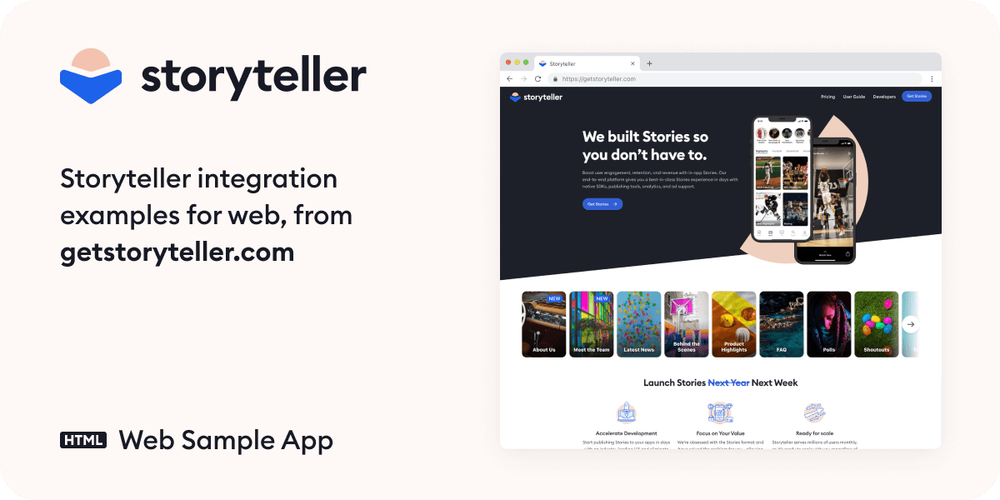

# Storyteller Web Sample App

  &nbsp;&nbsp;&nbsp;
  

[Web SDK Documentation](https://docs.getstoryteller.com/documents/web-sdk)

Use this repo as a reference for integrating Storyteller in your website.

Storyteller is also available for [iOS](https://github.com/getstoryteller/storyteller-sample-ios), [Android](https://github.com/getstoryteller/storyteller-sample-android) and [React Native](https://github.com/getstoryteller/storyteller-sdk-react-native).

For help with Storyteller, please check our [Documentation and User Guide](https://docs.getstoryteller.com/documents/) or contact [support@getstoryteller.com](mailto:support@getstoryteller.com?Subject=web%20Sample%20App).
## Html Sample

To run this sample:

1. `cd` to `samples/html` and run `npm install`
2. Supply your team's API Key by changing the value of `API_KEY` in `index.js`
3. Run `npm start`

## React Sample

To run this sample:

1. `cd` to `samples/react-sample` and run `npm install`
2. Supply your team's API Key by changing the value of `API_KEY` in `src/constants.js`
3. Run `npm start`

## Typescript Sample

To run this sample:

1. `cd` to `samples/typescript` and run `npm install`
2. Supply your team's API Key by changing the value of `API_KEY` in `index.ts`
3. Run `npm start`

## Requirements

Note that this sample uses Create React App which supports Node 16 and up. The Storyteller Web SDK delivers compiled Javascript so does not depend on a specific NodeJS version.